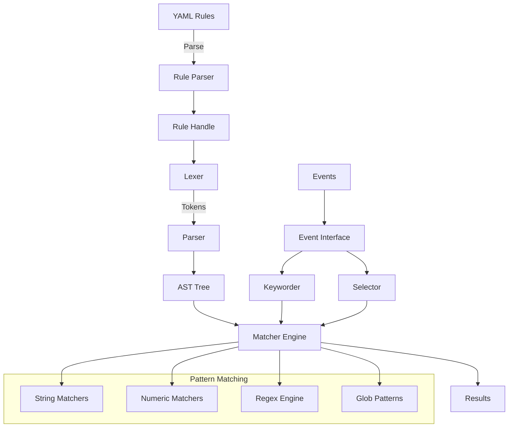
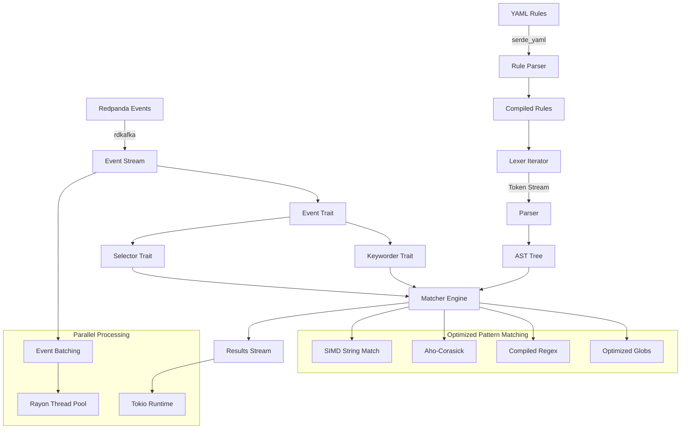
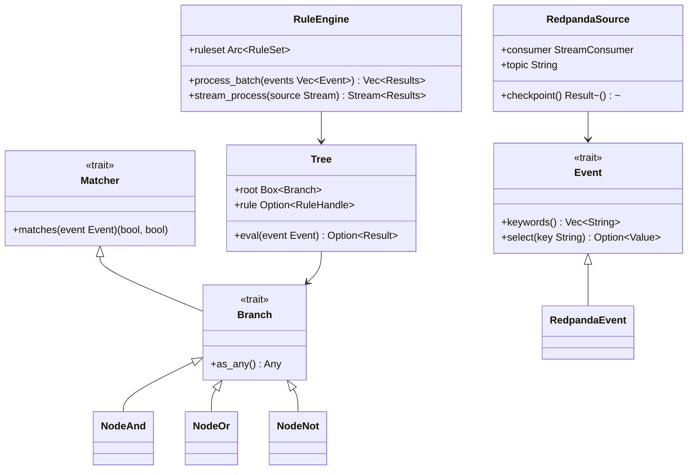
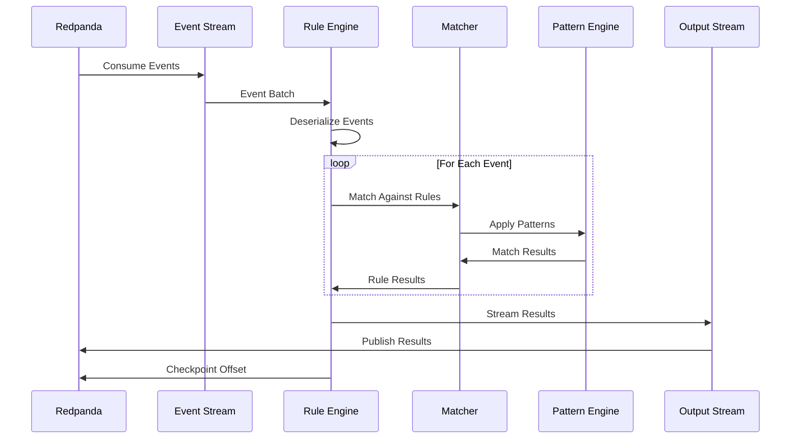
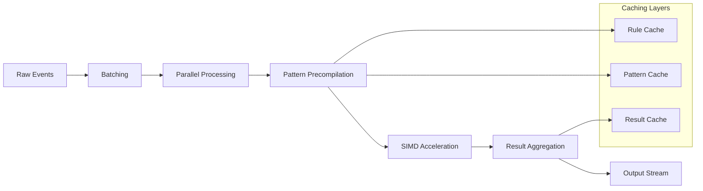
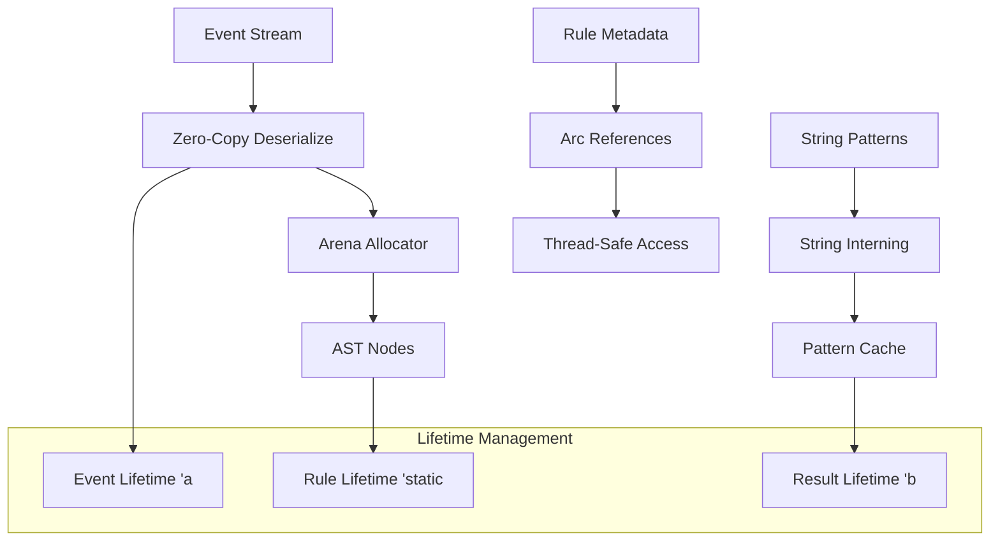

# Sigma Rule Engine Architecture Diagram

## Current Go Architecture

## Proposed Rust Architecture

## Component Relationships

## Data Flow

## Performance Optimization Strategy

## Memory Management

