# Bulletproof CI/CD Architecture for Sigma-rs

## Overview

This document describes the comprehensive CI/CD pipeline designed to ensure bulletproof code quality, security, and reliability for the sigma-rs project. The pipeline consists of multiple workflows that provide layered validation and automation.

## Pipeline Architecture

```mermaid
graph TD
    A[Code Push/PR] --> B[Main CI/CD Pipeline]
    B --> C[Code Quality Gates]
    B --> D[Security Scanning]
    B --> E[Cross-Platform Testing]
    B --> F[Performance Analysis]
    B --> G[Integration Testing]
    B --> H[Release Readiness]
    
    I[Enhanced Testing] --> J[Property-Based Testing]
    I --> K[Fuzz Testing]
    I --> L[Stress Testing]
    I --> M[Memory Safety]
    I --> N[Compatibility Testing]
    
    O[Security Comprehensive] --> P[Dependency Security]
    O --> Q[Code Security]
    O --> R[Vulnerability Scanning]
    O --> S[Secrets Detection]
    O --> T[Container Security]
    
    U[Performance Monitoring] --> V[Baseline Benchmarks]
    U --> W[Regression Detection]
    U --> X[Memory Analysis]
    U --> Y[Load Testing]
    U --> Z[Trend Analysis]
    
    AA[Release & Deployment] --> BB[Pre-Release Validation]
    AA --> CC[Cross-Platform Builds]
    AA --> DD[Publishing]
    AA --> EE[Security Attestation]
    AA --> FF[Post-Release Validation]
```

## Workflow Descriptions

### 1. Main CI/CD Pipeline (`main.yml`)

**Purpose**: Primary quality gate for all code changes

**Stages**:
1. **Code Quality Gates** - Formatting, linting, documentation checks
2. **Security Scanning** - Vulnerability assessment, dependency auditing
3. **Cross-Platform Testing** - Ubuntu, Windows, macOS with multiple Rust versions
4. **Performance & Coverage** - Code coverage (85% minimum), performance benchmarks
5. **Integration Testing** - Kafka integration, consumer testing
6. **Release Readiness** - Package validation, binary building

**Triggers**: Push to main/dev branches, Pull requests

### 2. Enhanced Testing Suite (`enhanced-testing.yml`)

**Purpose**: Comprehensive testing beyond basic unit tests

**Components**:
- **Property-Based Testing**: 50,000 PropTest + 50,000 QuickCheck cases
- **Fuzz Testing**: Lexer, parser, and rule fuzzing with libfuzzer
- **Stress Testing**: Memory stress, concurrent processing, performance under load
- **Memory Safety**: Miri validation for memory safety guarantees
- **Compatibility Testing**: MSRV validation, feature combinations, cross-compilation

**Triggers**: Push to main branches, PRs, daily scheduled runs

### 3. Comprehensive Security Analysis (`security-comprehensive.yml`)

**Purpose**: Multi-layered security validation

**Security Layers**:
- **Dependency Security**: cargo-audit, cargo-deny, supply chain analysis
- **Static Code Analysis**: Security-focused Clippy lints, unsafe pattern detection
- **Vulnerability Scanning**: Trivy, Semgrep, OSV Scanner with SARIF output
- **Secrets Detection**: TruffleHog, Gitleaks, custom pattern matching
- **Container Security**: Trivy container scan, Dockle linting (if Dockerfile exists)

**Triggers**: Push to main branches, PRs, daily scheduled runs

### 4. Performance Monitoring & Regression Detection (`performance-monitoring.yml`)

**Purpose**: Continuous performance validation and regression detection

**Analysis Types**:
- **Baseline Benchmarks**: Core, consumer, parser, pattern matching benchmarks
- **Regression Detection**: Automated comparison between PR and base branches
- **Memory Analysis**: Binary size analysis, memory usage profiling
- **Load Testing**: Stress testing with increasing concurrent loads
- **Trend Analysis**: Historical performance tracking and alerting

**Triggers**: Push to main branches, PRs, daily scheduled runs

### 5. Release & Deployment (`release.yml`)

**Purpose**: Bulletproof release automation with comprehensive validation

**Release Pipeline**:
1. **Pre-Release Validation**: Version validation, comprehensive testing, changelog verification
2. **GitHub Release Creation**: Automated release notes, proper versioning
3. **Cross-Platform Builds**: 6 targets including ARM64, Windows, macOS, Linux (musl)
4. **Publishing**: Crates.io (stable only), Docker multi-platform images
5. **Security Attestation**: SBOM generation, build provenance, security attestations
6. **Post-Release Validation**: Release completeness verification

**Triggers**: Git tags (v*), manual workflow dispatch

## Quality Gates

### Code Quality Standards

- **Formatting**: Must pass `cargo fmt --check`
- **Linting**: Zero Clippy warnings with pedantic and nursery lints
- **Documentation**: All public APIs documented, doc tests pass
- **Coverage**: Minimum 85% code coverage required
- **Unsafe Code**: Prohibited (`#![deny(unsafe_code)]`)

### Security Standards

- **Vulnerabilities**: Zero known vulnerabilities in dependencies
- **License Compliance**: Only approved licenses (Apache-2.0, MIT, BSD)
- **Secrets**: No hardcoded secrets or credentials
- **Supply Chain**: Verified dependency integrity
- **Container Security**: Secure container configuration

### Performance Standards

- **Benchmarks**: All benchmarks must complete successfully
- **Regression**: No performance degradation >20% without justification
- **Memory**: No memory leaks detected
- **Load Testing**: Must handle concurrent processing without failures

### Testing Standards

- **Unit Tests**: 100% of modules have unit tests
- **Integration Tests**: End-to-end workflow validation
- **Property Tests**: Fuzz testing for parser and lexer components
- **Cross-Platform**: All tests pass on Linux, Windows, macOS
- **Feature Testing**: All feature combinations tested

## Security Features

### Automated Security Scanning

- **Daily vulnerability scans** with multiple tools
- **Dependency monitoring** with automated alerts
- **Secrets scanning** on every commit
- **Container security** validation for Docker images
- **Supply chain** integrity verification

### Security Attestations

- **SBOM (Software Bill of Materials)** generation
- **Build provenance** attestation
- **Binary signing** and checksum verification
- **Security advisories** integration

### Compliance Monitoring

- **License compliance** tracking
- **Security policy** enforcement
- **Automated dependency updates** through Dependabot
- **Vulnerability disclosure** process

## Performance Monitoring

### Continuous Benchmarking

- **Automated performance testing** on every PR
- **Historical trend analysis** for performance regression detection
- **Memory profiling** and leak detection
- **Load testing** under various scenarios

### Performance Budgets

- **Parse time**: Target <1ms per rule
- **Memory usage**: <100MB baseline
- **Binary size**: <10MB optimized release
- **Startup time**: <100ms cold start

## Release Process

### Automated Release Pipeline

1. **Version Validation**: Ensure Cargo.toml matches release tag
2. **Quality Validation**: All tests and checks must pass
3. **Multi-Platform Builds**: Binaries for 6 target platforms
4. **Security Validation**: Security scans must pass
5. **Publishing**: Automated publishing to multiple registries
6. **Verification**: Post-release validation and testing

### Release Artifacts

- **Cross-platform binaries** with checksums
- **Docker images** for multiple architectures
- **Crates.io package** for stable releases
- **Security attestations** and SBOM
- **Release notes** with changelog integration

## Monitoring and Alerting

### Pipeline Monitoring

- **Workflow status** monitoring
- **Performance regression** alerts
- **Security vulnerability** notifications
- **Release pipeline** status tracking

### Quality Metrics

- **Test coverage trends** tracking
- **Performance benchmarks** historical data
- **Security scan results** trending
- **Build success rates** monitoring

## Best Practices

### Development Workflow

1. **Feature branches** with descriptive names
2. **Pull request** validation before merge
3. **Semantic commit messages** for automated changelog
4. **Comprehensive testing** before submission

### Security Practices

1. **Regular dependency updates** through automated PRs
2. **Security-first development** with automated scanning
3. **Secrets management** with environment variables
4. **Vulnerability response** process documented

### Performance Practices

1. **Performance testing** on every change
2. **Benchmark-driven optimization** decisions
3. **Memory efficiency** monitoring
4. **Resource usage** profiling

## Failure Handling

### Automatic Recovery

- **Retry mechanisms** for flaky tests
- **Fallback strategies** for external service failures
- **Graceful degradation** for non-critical checks

### Manual Intervention

- **Clear failure messages** with remediation steps
- **Artifact preservation** for debugging
- **Escalation procedures** for critical failures

## Continuous Improvement

### Pipeline Evolution

- **Regular pipeline reviews** and optimization
- **Tool updates** and security patches
- **Performance improvements** based on metrics
- **Community feedback** integration

### Metrics-Driven Improvements

- **Pipeline execution times** optimization
- **Success rate improvements** targeting
- **Developer experience** enhancements
- **Security posture** strengthening

## Conclusion

This bulletproof CI/CD architecture ensures that sigma-rs maintains the highest standards of code quality, security, and performance. The multi-layered approach provides comprehensive validation while maintaining developer productivity and enabling rapid, safe releases.

The pipeline is designed to be:
- **Reliable**: Multiple validation layers catch issues early
- **Secure**: Comprehensive security scanning and attestation
- **Fast**: Parallel execution and intelligent caching
- **Maintainable**: Clear structure and automated updates
- **Scalable**: Designed to grow with the project

Regular monitoring and continuous improvement ensure the pipeline remains effective and efficient as the project evolves.