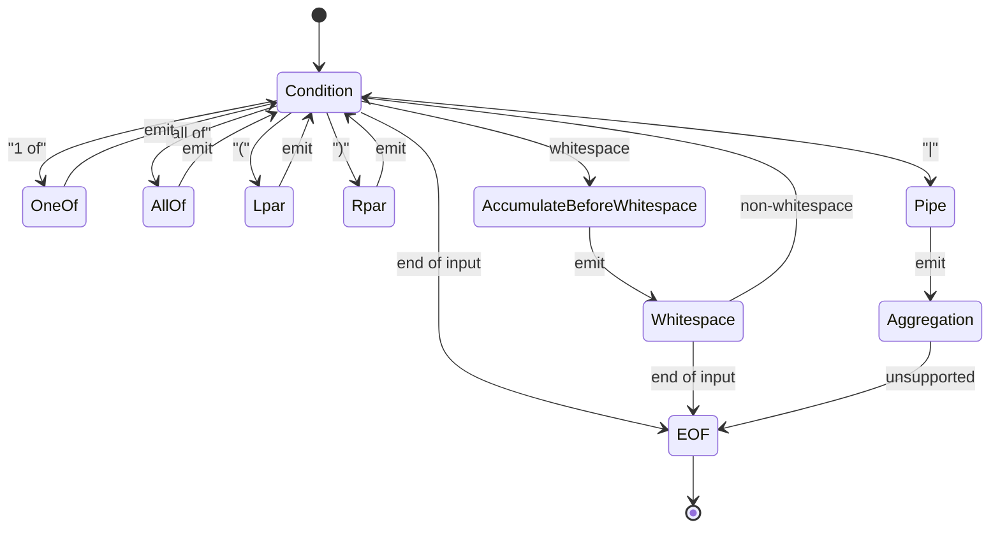

# Lexer Architecture

## Overview

The Rust lexer implementation follows a state machine pattern similar to the Go version, but leverages Tokio for async operations and Rust's pattern matching for state transitions.

```mermaid
graph TB
    A[Input String] --> B[Lexer::new]
    B --> C[Lexer Instance]
    B --> D[mpsc::Receiver<Item>]
    
    C --> E[tokio::spawn]
    E --> F[scan() loop]
    
    F --> G{State Machine}
    G --> H[Condition]
    G --> I[OneOf]
    G --> J[AllOf]
    G --> K[Whitespace]
    G --> L[Lpar/Rpar]
    G --> M[Pipe]
    G --> N[EOF]
    
    H --> O[emit(Token)]
    I --> O
    J --> O
    K --> O
    L --> O
    M --> O
    N --> O
    
    O --> P[mpsc::Sender]
    P --> D
    
    D --> Q[Parser/Consumer]
```

## State Machine Design



## Key Components

### 1. Token Types

```rust
#[repr(u8)]
#[derive(Debug, Clone, Copy, PartialEq)]
pub enum Token {
    // Identifiers
    Identifier,
    IdentifierWithWildcard,
    IdentifierAll,
    
    // Keywords
    KeywordAnd,
    KeywordOr,
    KeywordNot,
    
    // Statements
    StmtOneOf,
    StmtAllOf,
    
    // Separators
    SepLpar,
    SepRpar,
    SepPipe,
    
    // Special
    LitEof,
    Error,
    Unsupported,
}
```

### 2. Item Structure

```rust
pub struct Item {
    pub token: Token,
    pub value: Cow<'a, str>,
    pub glob: Option<GlobPattern>,
}
```

### 3. Lexer Structure

```rust
pub struct Lexer {
    input: String,
    start: usize,
    position: usize,
    width: usize,
    items_tx: mpsc::Sender<Item>,
}
```

## Async Flow

1. **Creation**: `Lexer::new(input)` returns `(Lexer, Receiver<Item>)`
2. **Spawning**: `tokio::spawn(lexer.scan())` runs the state machine
3. **Communication**: Items sent via `mpsc::Sender` to parser
4. **Completion**: Channel closes when lexer finishes

## Error Handling

```rust
#[derive(Debug, Error)]
pub enum LexError {
    #[error("Unsupported token: {0}")]
    UnsupportedToken(String),
    
    #[error("Invalid token sequence: {prev:?} -> {next:?}")]
    InvalidSequence { prev: Token, next: Token },
    
    #[error("Unexpected end of input")]
    UnexpectedEof,
}
```

## Performance Considerations

1. **Zero-copy**: Use string slices where possible
2. **Async efficiency**: Unbuffered channels for low latency
3. **Memory**: Pre-allocated buffers for known patterns
4. **UTF-8**: Careful handling of character boundaries

## Testing Strategy

1. **Unit tests**: Each state function
2. **Integration tests**: Full lexing examples
3. **Property tests**: Random input validation
4. **Benchmarks**: Performance comparison with Go